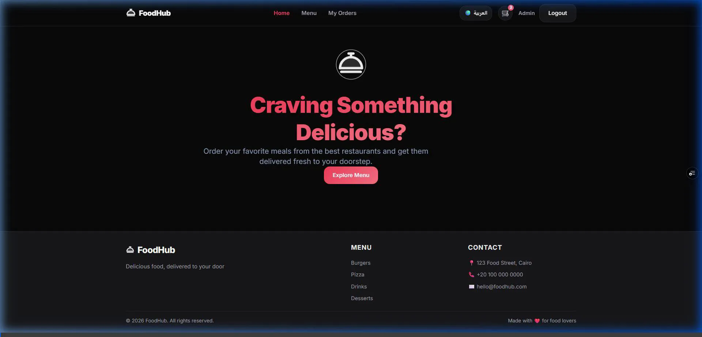
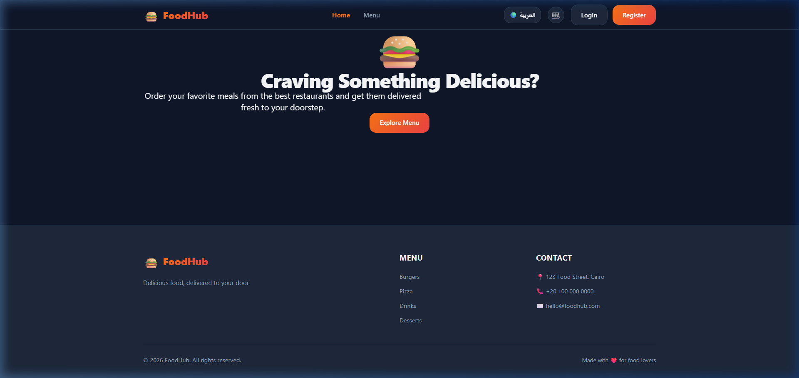
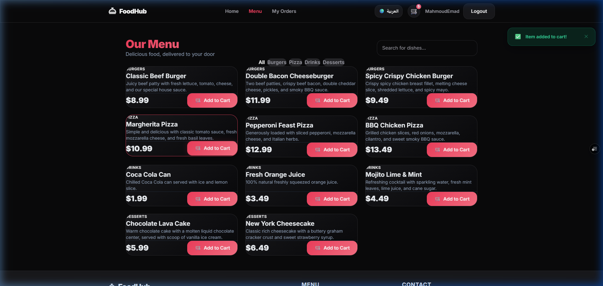
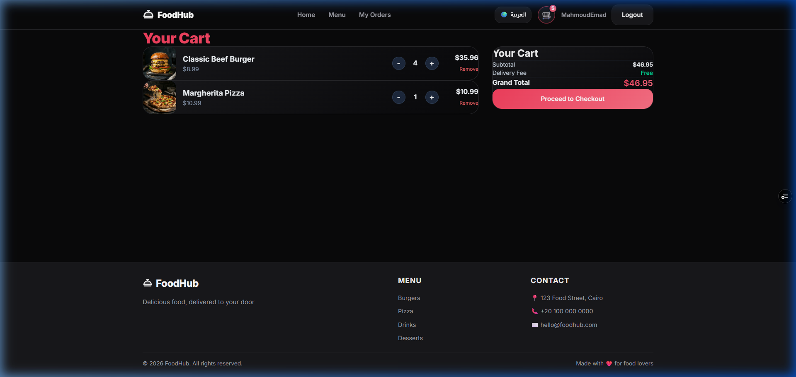
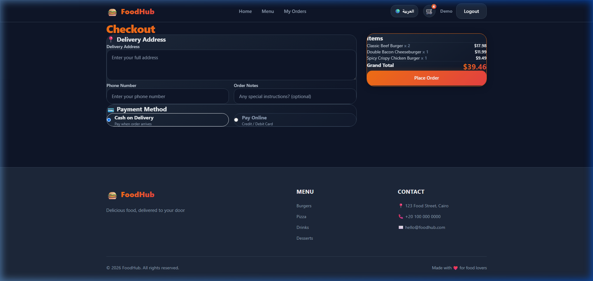
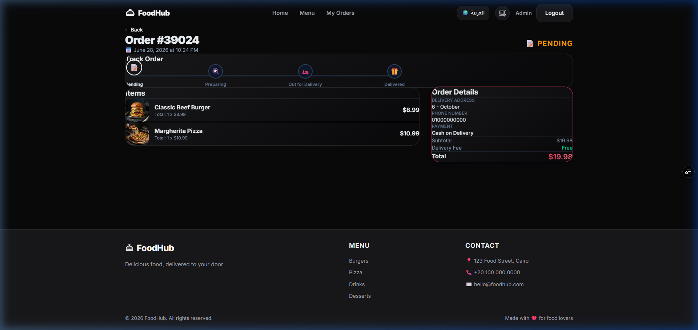
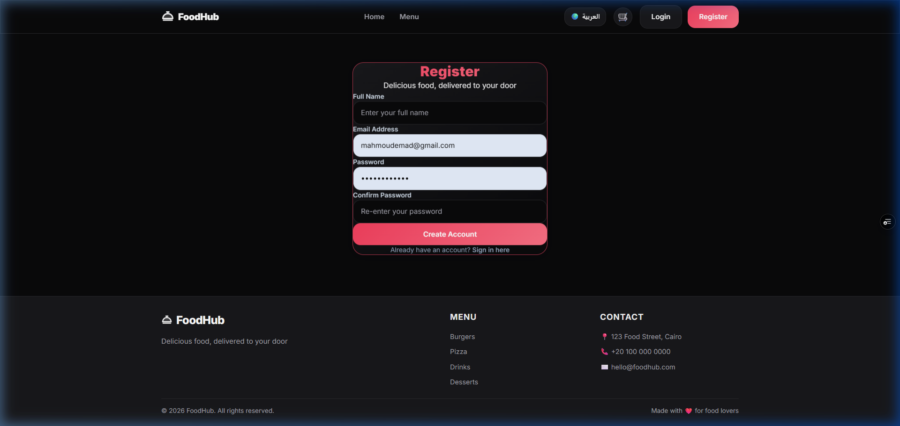
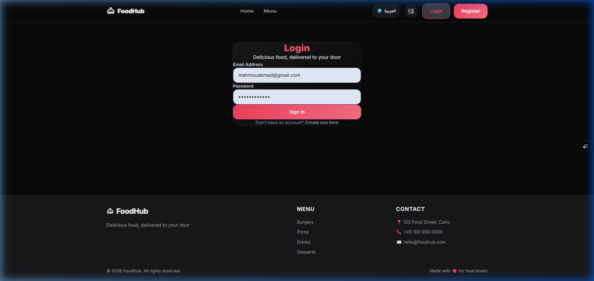
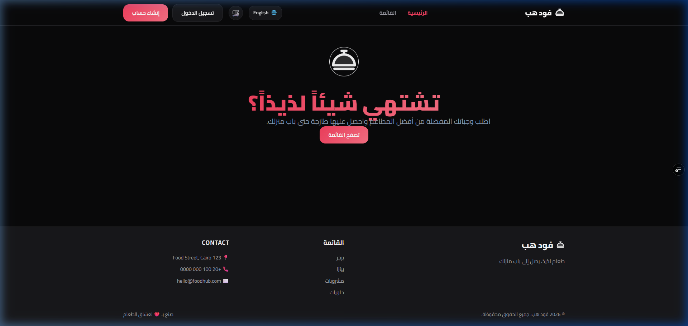

<p align="center">
  
  
  
  
  
</p>

<h1 align="center">🍔 FoodieExpress — Online Food Ordering System</h1>

<p align="center">
  <strong>A modern, full-stack food ordering prototype featuring bilingual support, role-based access, mock payment processing, and a sleek glassmorphism UI.</strong>
</p>

<p align="center">
  🌐 <strong>Live Demo:</strong> <a href="https://food-order-client-eyc5g3jyi-mahmoudemad-devs-projects.vercel.app/">FoodieExpress Client (Vercel)</a>
  &nbsp;|&nbsp;
  📑 <strong>API Documentation:</strong> <a href="https://online-food-prototype1.runasp.net/swagger/index.html">Swagger UI (MonsterASP)</a>
</p>

<p align="center">
  <a href="#-recent-updates--enhancements">Recent Updates</a> •
  <a href="#-features">Features</a> •
  <a href="#-tech-stack">Tech Stack</a> •
  <a href="#-screenshots">Screenshots</a> •
  <a href="#%EF%B8%8F-getting-started">Getting Started</a> •
  <a href="#-project-structure">Project Structure</a> •
  <a href="#-api-endpoints">API Endpoints</a> •
  <a href="#-admin-test-credentials">Admin Credentials</a>
</p>

---

## 🚀 Recent Updates & Enhancements

- 🎨 **Enhanced UI Redesign** — Transformed the application color scheme with vibrant, modern warm-amber/orange gradients and fully responsive glassmorphism containers. Main pages are now perfectly centered on high-resolution displays.
- 🚀 **Cloud Deployment** — The full-stack app is now fully deployed. The frontend is hosted on **Vercel**, and the ASP.NET Core API is hosted on **MonsterASP.NET** with a persistent SQLite database.
- 🔗 **Live Swagger API Docs** — Easily inspect and test backend API endpoints live through the [Interactive Swagger UI](https://online-food-prototype1.runasp.net/swagger/index.html).
- 🔄 **Robust CORS & Security** — Configured dynamic CORS policy to support smooth integration across localhost, Vercel deployments, and production URLs.
- 💾 **API Failure Fallback** — Enhanced checkout robustness by implementing client-side order fallback to local mock storage if the backend API is temporarily offline.

---

## ✨ Features

### 🛒 Customer Experience
- **Browse Menu** — Explore food items by category (Burgers, Pizza, Drinks, Desserts) with bilingual product names and descriptions.
- **Shopping Cart** — Add, update quantities, and remove items with real-time total calculation. Cart persists via Context API.
- **Checkout & Payment** — Choose between Cash on Delivery (COD) and Online Payment with a **mock credit-card processor**.
- **Order Tracking** — View your complete order history, individual order details, and real-time status updates (`Pending → Preparing → Out for Delivery → Delivered`).

### 🔐 Authentication & Authorization (RBAC)
- **JWT-Based Authentication** — Secure login/register with hashed passwords (BCrypt) and token-based sessions.
- **Role-Based Access Control** — Two distinct roles: `Customer` and `Admin`. Protected routes on both frontend and backend enforce granular access.
- **Route Guards** — `ProtectedRoute` and `AdminRoute` higher-order components prevent unauthorized access on the client side.

### 🌍 Internationalization (i18n)
- **Bilingual Interface** — Full English 🇬🇧 and Arabic 🇸🇦 support across the entire application.
- **RTL Layout Support** — Automatic right-to-left layout when Arabic is selected.
- **Language Persistence** — User's language preference is saved to `localStorage` and auto-detected on return visits.

### 🛠 Admin Dashboard
- **Dashboard Overview** — Statistics and metrics at a glance.
- **Product Management** — Full CRUD operations: create, edit, delete products with image upload support.
- **Order Management** — View all customer orders and update their status through the delivery pipeline.

### 💎 UI / UX
- **Glassmorphism Design** — Modern frosted-glass aesthetic with vibrant gradients and smooth micro-animations.
- **Fully Responsive** — Optimized for desktop, tablet, and mobile with a collapsible hamburger navigation.
- **Toast Notifications** — Non-intrusive feedback for user actions (add to cart, order placed, errors).
- **Error Boundary** — Graceful error handling with a user-friendly fallback UI.
- **404 Page** — Custom not-found page for unmatched routes.

---

## 🛠 Tech Stack

| Layer        | Technology                                                                                              |
| ------------ | ------------------------------------------------------------------------------------------------------- |
| **Frontend** | React 19, TypeScript 6, Vite 8, React Router 7, Tailwind CSS 4, i18next, Axios                        |
| **Backend**  | ASP.NET Core 10 (Minimal Hosting), Entity Framework Core 10, SQLite                                    |
| **Auth**     | JWT Bearer Tokens, BCrypt.Net password hashing                                                          |
| **Payment**  | Mock Payment Service (simulated card processing with configurable delay)                                |
| **API Docs** | Swagger / OpenAPI (Swashbuckle) with JWT auth support                                                   |
| **Tooling**  | ESLint, Vite HMR, .NET Hot Reload                                                                      |

---

## 🎬 Demo Walkthrough

> Live recorded walkthrough of the complete order placement flow.



---

## 📸 Screenshots

### 🏠 Home Page


### 🍕 Menu Page


### 🛒 Cart Page


### 💳 Checkout Page


### 📦 Order Details & Tracking


### 📝 Register Page


### 🔐 Login Page


### 🌍 Arabic (RTL) Mode


---

## ⚙️ Getting Started

### Prerequisites

Make sure you have the following installed:

| Tool | Version | Download |
|------|---------|----------|
| **.NET SDK** | 10.0+ | [dotnet.microsoft.com](https://dotnet.microsoft.com/download) |
| **Node.js** | 20+ (LTS recommended) | [nodejs.org](https://nodejs.org/) |
| **npm** | 10+ (bundled with Node.js) | — |
| **Git** | Latest | [git-scm.com](https://git-scm.com/) |

---

### 1️⃣ Clone the Repository

```bash
git clone https://github.com/your-username/Online-Food-Ordering.git
cd Online-Food-Ordering
```

---

### 2️⃣ Backend Setup (ASP.NET Core API)

```bash
# Navigate to the API project
cd FoodOrderAPI

# Restore NuGet packages
dotnet restore

# Apply database migrations (creates the SQLite database)
dotnet ef database update

# Run the API server
dotnet run
```

> The API will start at **`https://localhost:5001`** (or `http://localhost:5000`).
> Swagger UI is available at **`https://localhost:5001/swagger`** in development mode.

#### ⚙️ Configuration

The backend is configured via [`appsettings.json`](FoodOrderAPI/appsettings.json):

```jsonc
{
  "ConnectionStrings": {
    "DefaultConnection": "Data Source=FoodOrder.db"     // SQLite database file
  },
  "JwtSettings": {
    "SecretKey": "YourSuperSecretKeyForJWT_MustBeAtLeast32Characters!",
    "Issuer": "FoodOrderAPI",
    "Audience": "FoodOrderClient",
    "ExpirationInDays": 7
  },
  "CorsSettings": {
    "AllowedOrigins": ["http://localhost:5173"]          // Vite dev server
  }
}
```

---

### 3️⃣ Frontend Setup (React + Vite)

```bash
# Navigate to the client project (from the root)
cd food-order-client

# Install dependencies
npm install

# Start the development server
npm run dev
```

> The app will open at **`http://localhost:5173`**.

#### 🔗 API Base URL

The frontend communicates with the backend via Axios. If your backend runs on a different port, update the base URL in the API configuration files located in `food-order-client/src/api/`.

---

### 4️⃣ Verify Everything is Running

#### 💻 Local Development
| Service       | URL                                      | Status   |
| ------------- | ---------------------------------------- | -------- |
| Frontend      | `http://localhost:5173`                  | ✅ React App |
| Backend API   | `https://localhost:5001`                 | ✅ .NET API  |
| Swagger Docs  | `https://localhost:5001/swagger`         | ✅ API Docs  |

#### 🌐 Live Production Deployments
| Service       | URL                                      | Status   |
| ------------- | ---------------------------------------- | -------- |
| Live Frontend | [FoodieExpress (Vercel)](https://food-order-client-eyc5g3jyi-mahmoudemad-devs-projects.vercel.app/) | ✅ Deployed & Online |
| Live Backend API | [MonsterASP API Root](https://online-food-prototype1.runasp.net/) | ✅ Running |
| Live Swagger Docs | [Swagger UI](https://online-food-prototype1.runasp.net/swagger/index.html) | ✅ Docs Online |

---

## 📁 Project Structure

```
Online-Food-Ordering/
├── 📂 FoodOrderAPI/                    # ASP.NET Core Web API
│   ├── 📂 Controllers/                 # API endpoints
│   │   ├── AuthController.cs           #   → Register, Login
│   │   ├── ProductsController.cs       #   → Browse products
│   │   ├── CartController.cs           #   → Cart operations
│   │   ├── OrdersController.cs         #   → Place & track orders
│   │   └── AdminController.cs          #   → Admin CRUD + order management
│   ├── 📂 Models/                      # EF Core entity models
│   │   ├── User.cs                     #   → User with Role enum (Customer/Admin)
│   │   ├── Product.cs                  #   → Bilingual name/description fields
│   │   ├── Order.cs                    #   → Order with status pipeline
│   │   ├── OrderItem.cs                #   → Line items for orders
│   │   └── CartItem.cs                 #   → User shopping cart items
│   ├── 📂 DTOs/                        # Data Transfer Objects
│   ├── 📂 Services/                    # Business logic layer
│   │   ├── Implementations/
│   │   │   ├── AuthService.cs          #   → JWT generation + BCrypt hashing
│   │   │   └── MockPaymentService.cs   #   → Simulated card payment processor
│   │   └── Interfaces/
│   ├── 📂 Repositories/               # Data access layer (Repository Pattern)
│   ├── 📂 Middleware/                  # Global exception handling
│   ├── 📂 Helpers/                     # JWT helper utilities
│   ├── 📂 Data/                        # EF Core DbContext + seed data
│   ├── 📂 Migrations/                  # Database migration files
│   ├── Program.cs                      # Application entry point & DI configuration
│   └── appsettings.json                # App configuration
│
├── 📂 food-order-client/               # React + TypeScript Frontend
│   ├── 📂 src/
│   │   ├── 📂 api/                     # Axios HTTP client configuration
│   │   ├── 📂 components/
│   │   │   ├── 📂 common/              # Shared components
│   │   │   │   ├── AdminRoute.tsx      #   → Admin role guard
│   │   │   │   ├── ProtectedRoute.tsx  #   → Auth guard
│   │   │   │   ├── ErrorBoundary.tsx   #   → Graceful error fallback
│   │   │   │   ├── LanguageSwitcher.tsx#   → EN/AR toggle button
│   │   │   │   └── LoadingSpinner.tsx  #   → Loading indicator
│   │   │   ├── 📂 layout/             # Navbar, Footer, Layout shell
│   │   │   └── 📂 menu/               # Menu-specific components
│   │   ├── 📂 contexts/               # React Context providers
│   │   │   ├── AuthContext.tsx         #   → Auth state & JWT management
│   │   │   ├── CartContext.tsx         #   → Shopping cart state
│   │   │   └── ToastContext.tsx        #   → Toast notification system
│   │   ├── 📂 i18n/                   # Internationalization
│   │   │   ├── en.json                #   → English translations
│   │   │   ├── ar.json                #   → Arabic translations
│   │   │   └── i18n.ts                #   → i18next configuration
│   │   ├── 📂 pages/                  # Page-level components
│   │   │   ├── HomePage.tsx
│   │   │   ├── MenuPage.tsx
│   │   │   ├── CartPage.tsx
│   │   │   ├── CheckoutPage.tsx
│   │   │   ├── OrdersPage.tsx
│   │   │   ├── OrderDetailPage.tsx
│   │   │   ├── LoginPage.tsx
│   │   │   ├── RegisterPage.tsx
│   │   │   ├── NotFoundPage.tsx
│   │   │   └── 📂 admin/
│   │   │       ├── AdminDashboard.tsx
│   │   │       ├── AdminProducts.tsx
│   │   │       └── AdminOrders.tsx
│   │   ├── 📂 types/                  # TypeScript type definitions
│   │   ├── 📂 utils/                  # Utility functions
│   │   ├── App.tsx                    # Root component with routing
│   │   ├── index.css                  # Global styles & design system
│   │   └── main.tsx                   # React entry point
│   ├── index.html
│   ├── vite.config.ts
│   ├── tsconfig.json
│   └── package.json
│
└── README.md                           # ← You are here
```

---

## 🔌 API Endpoints

### 🔓 Authentication

| Method | Endpoint            | Description           | Auth Required |
| ------ | ------------------- | --------------------- | ------------- |
| POST   | `/api/auth/register` | Register a new user   | ❌            |
| POST   | `/api/auth/login`    | Login & receive JWT   | ❌            |

### 🍕 Products

| Method | Endpoint          | Description           | Auth Required |
| ------ | ----------------- | --------------------- | ------------- |
| GET    | `/api/products`    | List all products     | ❌            |

### 🛒 Cart

| Method | Endpoint                  | Description              | Auth Required |
| ------ | ------------------------- | ------------------------ | ------------- |
| GET    | `/api/cart`                | Get current user's cart  | ✅ Customer   |
| POST   | `/api/cart`                | Add item to cart         | ✅ Customer   |
| PUT    | `/api/cart/{id}`           | Update item quantity     | ✅ Customer   |
| DELETE | `/api/cart/{id}`           | Remove item from cart    | ✅ Customer   |
| DELETE | `/api/cart`                | Clear entire cart        | ✅ Customer   |

### 📦 Orders

| Method | Endpoint              | Description              | Auth Required |
| ------ | --------------------- | ------------------------ | ------------- |
| GET    | `/api/orders`          | Get user's orders        | ✅ Customer   |
| GET    | `/api/orders/{id}`     | Get order details        | ✅ Customer   |
| POST   | `/api/orders`          | Place a new order        | ✅ Customer   |

### 🛡️ Admin

| Method | Endpoint                        | Description              | Auth Required |
| ------ | ------------------------------- | ------------------------ | ------------- |
| GET    | `/api/admin/dashboard`           | Dashboard statistics     | ✅ Admin      |
| GET    | `/api/admin/products`            | List all products        | ✅ Admin      |
| POST   | `/api/admin/products`            | Create a product         | ✅ Admin      |
| PUT    | `/api/admin/products/{id}`       | Update a product         | ✅ Admin      |
| DELETE | `/api/admin/products/{id}`       | Delete a product         | ✅ Admin      |
| GET    | `/api/admin/orders`              | List all orders          | ✅ Admin      |
| PUT    | `/api/admin/orders/{id}/status`  | Update order status      | ✅ Admin      |

---

## 🔑 Admin Test Credentials

Use the following pre-seeded admin account to explore the admin dashboard:

```
📧 Email:    admin@test.com
🔒 Password: Admin@123
```

> **Note:** You can also register a new account as a regular **Customer** through the registration page to test the customer-facing features.

---

## 💳 Mock Payment

The online payment feature uses a **simulated payment processor** (`MockPaymentService`). It accepts any valid-looking card details and approves the transaction after a 1-second delay. No real charges are made.

| Field        | Test Value                  |
| ------------ | --------------------------- |
| Card Number  | `4111 1111 1111 1111`       |
| Expiry       | Any future date (e.g. `12/28`) |
| CVV          | Any 3 digits (e.g. `123`)    |

---

## 🏗️ Architecture Highlights

```
┌─────────────────────┐         ┌──────────────────────────────┐
│   React Frontend    │  HTTP   │     ASP.NET Core API         │
│   (Vite + TS)       │────────▶│                              │
│                     │  JWT    │  Controllers                 │
│  • React Router     │◀────────│    ↓                         │
│  • i18next (EN/AR)  │         │  Services (Auth, Payment)    │
│  • Context API      │         │    ↓                         │
│  • Axios            │         │  Repositories                │
│  • Tailwind CSS     │         │    ↓                         │
│  • Route Guards     │         │  EF Core → SQLite            │
└─────────────────────┘         └──────────────────────────────┘
```

- **Repository Pattern** — Clean separation between data access and business logic.
- **Dependency Injection** — All services and repositories registered through the built-in .NET DI container.
- **Global Exception Handling** — `ExceptionMiddleware` catches unhandled exceptions and returns consistent error responses.
- **JWT Auth Pipeline** — `UseAuthentication()` → `UseAuthorization()` middleware ensures secure endpoint access.

---

## 📄 License

This project is built as a **prototype / academic demonstration**. Feel free to use it for learning and reference purposes.

---

<p align="center">
  Made with ❤️ using <strong>.NET 10</strong> & <strong>React 19</strong>
</p>